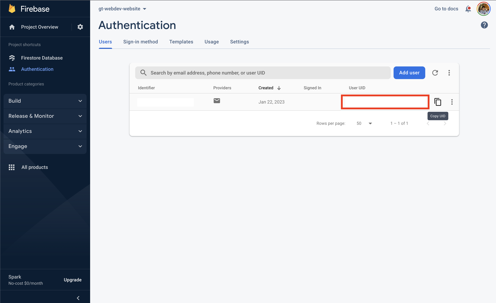

# GT Web Dev Website

## About
GT Web Dev website

## Requirements
- [NodeJS 18.x](https://nodejs.org/en/)
  - Tip: install it using [nvm](https://github.com/nvm-sh/nvm) to easily manage versions

## Get Started
Clone Repo
```
git clone https://github.com/gt-webdev/gt-webdev-website
```
Start the app
```
npm install
npm run dev
```
Open [http://localhost:3000](http://localhost:3000) to view it in the browser.

## How to Add Firebase API Credentials

Refer to [credentials document](https://docs.google.com/document/d/1tnGvafEfU0Iy-EnsLgH6mPMvDm984vUaa-Z_sLcSXMU/edit) for link to .env file

Create `.env` file with following content (derived from Firebase Admin SDK JSON) and place the file in the root of the repository folder:

```shell
firebase_type="..."
firebase_project_id="..."
firebase_private_key_id="..."
firebase_private_key="..."
firebase_client_email="..."
firebase_client_id="..."
firebase_auth_uri="..."
firebase_token_uri="..."
firebase_auth_provider_x509_cert_url="..."
firebase_client_x509_cert_url="..."
```

## How to Promote a Firebase User to Admin

Add Firebase credentials via .env file (mentioned above)

Then run the following command:

```shell
node scripts/promote-to-admin.js user_uid
```

The ID for a user can be found in Firebase:



## How to Login as an Admin User

- Visit [http://localhost:3000/login](http://localhost:3000/login)
- Enter the credentials for the [admin Firebase user account](https://docs.google.com/document/d/1tnGvafEfU0Iy-EnsLgH6mPMvDm984vUaa-Z_sLcSXMU/edit)
